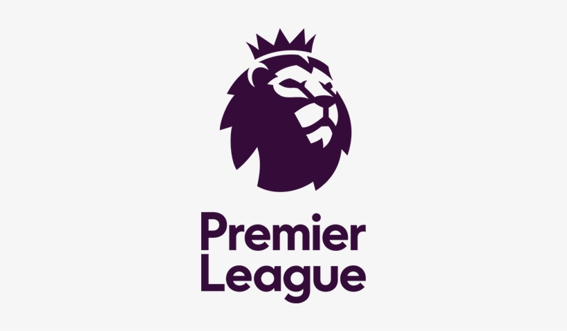
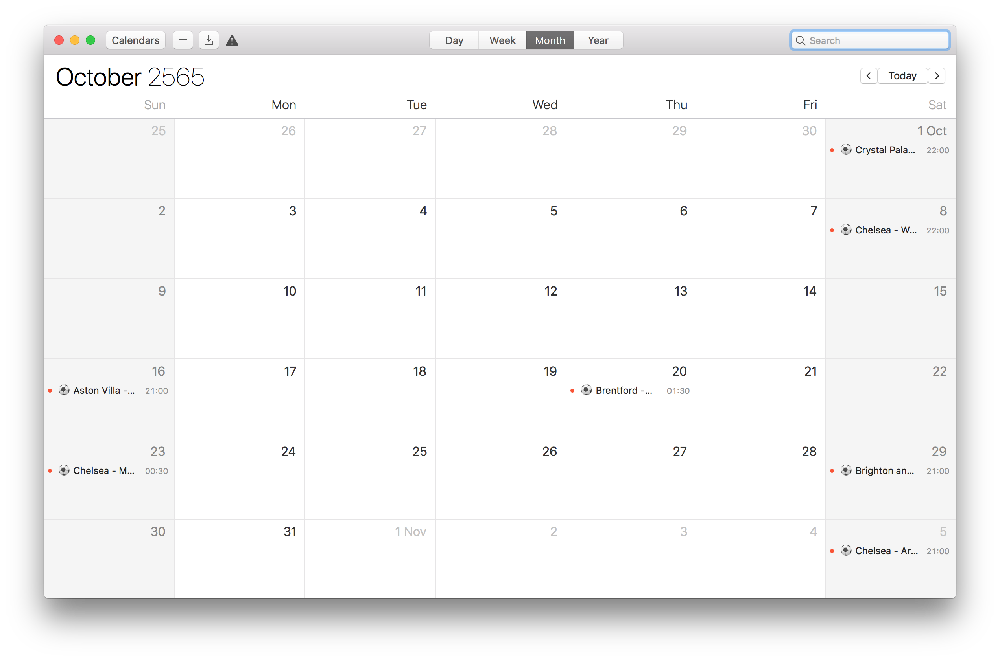

# ⚽ Chelsea Fixtures Calendar 2022/23

This application can create a Premier league fixture as an event on Google Calendar as you want.

I have prepared for an English premier league fixture. But I am a **Chelsea** fan.
So, I will create a fixture as a `JSON` file only for Chelsea. 😜

Do not worry. If you are a fan of other teams, you can take the time to add your team fixture in the `JSON` file.

> 🛎️ IMPORTANT: for this app version. you can only set for one team per day(even though it is an array in json😂) or you can help me to do it. lol



## If I am a Chelsea fan?

Just run! 🏃‍♂️

## If I am not a Chelsea fan?

You will see the `fixture` file in the fixture folder. You can use this file to view the fixtures.

For example, you are an `Everton` fan. you can add your team fixtures to `fixture.json` like this

```json
[
  {
    "date": {
      "datetime": "21-08-2022",
      "month": "August"
    },
    "fixtures": [
      {
        "home": "Everton",
        "away": "Nottingham Forest",
        "time": "21:00"
      }
    ]
  },

  ....

]
```

And yes, I hard coding for Premier league fixtures. I try to find an API or scrapping the website but maybe I am lazy to do. If you are not like me, do it and create a pull request!

## TODO

- Fix `toCalendarEvent` for support more fixtures per day
- Fetch the fixtures data from API or scrapping or somethings better
- Fix convert date function for support when it cross over the month or year

---

## Table of Contents

- [Prerequisite](#prerequisite)
- [Installation](#installation)
- [Run](#run)
- [Run Test](#run-test)

## Prerequisite

- Google cloud project (and enable Google Calendar API)
- NodeJS
- Computer
- Googling skill (Google Calendar API document is suck! 😠)

## Installation

```bash
npm install
```

## Run

```bash
node app.js
```

## Run Test

```bash
npm run test
```
